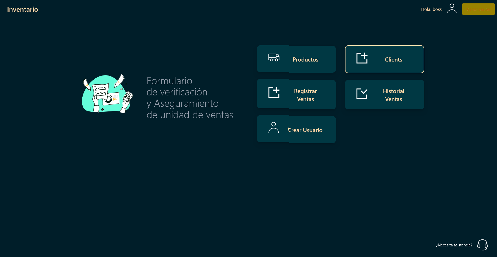
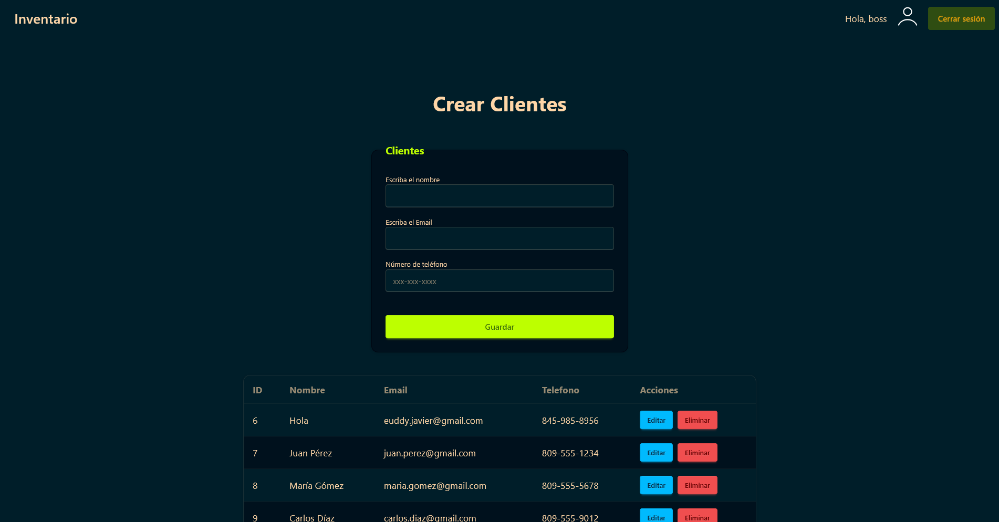
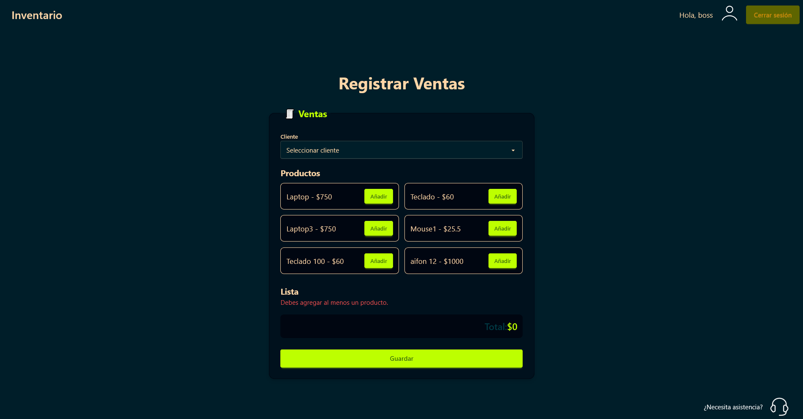
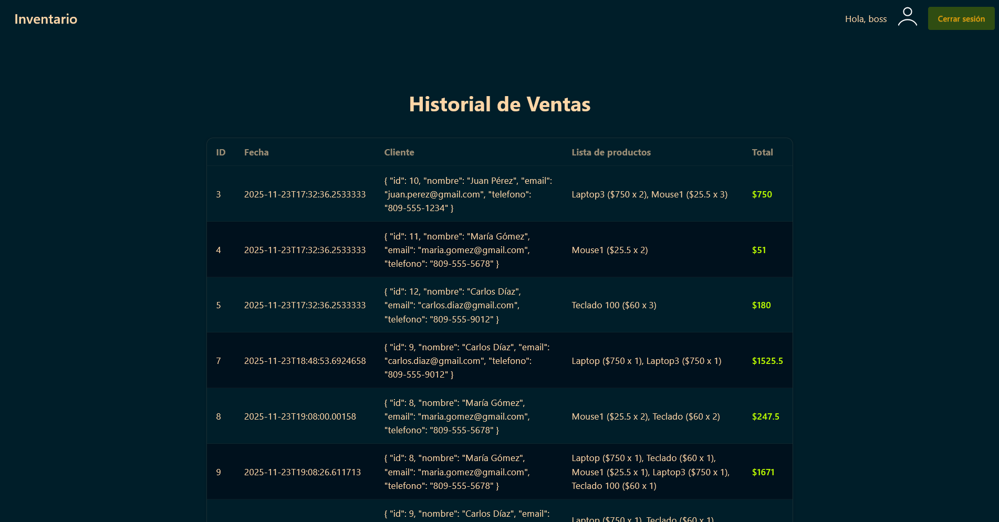
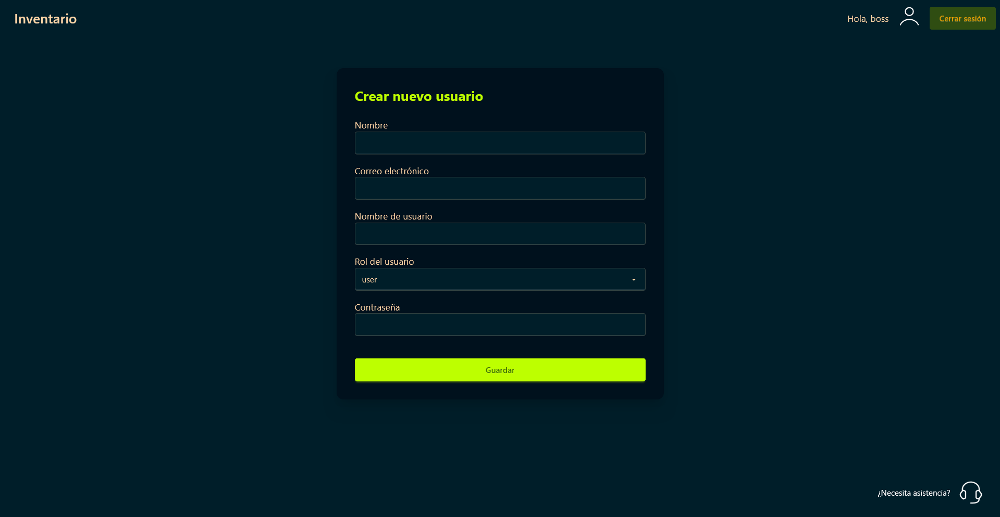
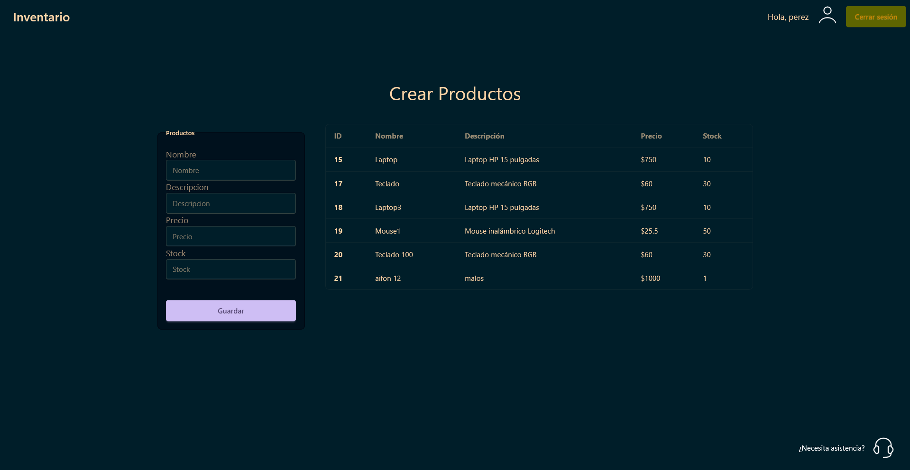

# Fronted

📌 Descripción del Frotend

El diseño está construido con TailwindCSS y DaisyUI, garantizando una interfaz moderna, responsiva y adaptable tanto a dispositivos móviles como de escritorio. El consumo de la API se realiza mediante Axios, mientras que el manejo global del estado se gestiona con Pinia, permitiendo sincronización fluida entre componentes y vistas.

## Screenshots

